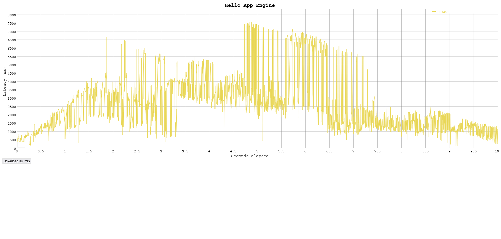
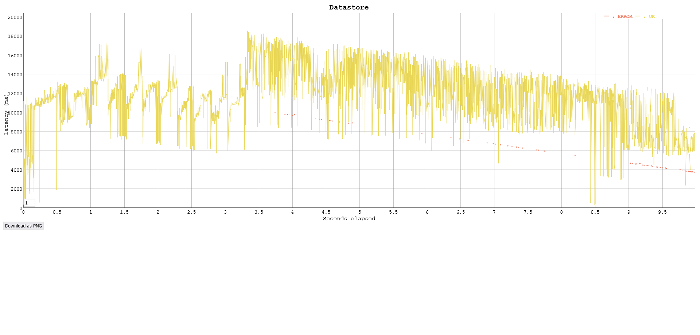
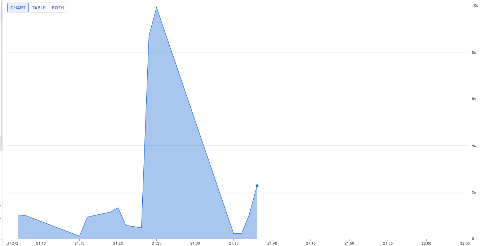
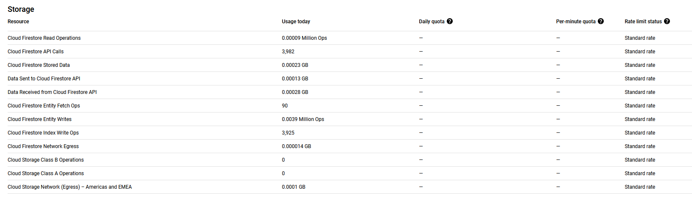

## Task 3: Test the performance of Datastore writes

In this task you will performance test the App Engine platform with a
load generator. You will compare the performance of normal request
processing and request processing that involves Datastore write
operations.

As the Servlets are deployed with Automatic Scaling, there is a danger
of consuming a lot of resources while testing, and burning through a
lot of money. Google gave you a coupon with some money that was put
into a billing account. Projects can have spending limits, but by
default it is unlimited. Before starting the performance test, you
have to set a reasonable daily spending limit.

Set a daily spending limit on the project as follows:

- In the Cloud Platform console navigate to **App Engine** >
  **Settings**. Click on **Edit**. Enter a daily spending limit of
  **$1.00**. (Note: Google has removed this functionality in January 2020. There is no replacement for it yet. Skip this step, but observe how many credits you have left before and after the performance tests. You can also limit the number of instances with an optional configuration of the autoscaling algorithm: In the file `appengine-web.xml` in the `<automatic-scaling>` element add a `<max-instances>` element with a small value (3, 4, ...). See <https://cloud.google.com/appengine/docs/standard/java/config/appref#scaling_elements>. An alternative is to use **Budgets & alerts**. In the Cloud Platform console navigate to **Billing** > **Budgets & alerts**. Create a new budget for the month for an amount of **$1.00** and optionally set the actions associated with the alert.)

Conduct the performance tests as follows:

1. You should already have vegeta installed from previous labs. If not, see <https://blog.absyah.dev/super-simple-guide-for-load-testing-using-vegeta#heading-install-vegeta>.

2. First test the performance of normal request processing using the
   Servlet generated by the wizard.

   - Prepare an "attack" using vegeta.

   - In the App Engine console open the **Dashboard**.

   - Run the attack.

   - In the dashboard observe the graph of the incoming requests, the
     number of instances and the latency.

3. Test the performance of the Servlet that writes to the Datastore.

4. At the end of the tests observe in detail how much resources were
   used. In the console click on **Quota Details**.

5. If you are running out of resources because of the monthly spending
   limit, increase it carefully by a dollar or two.

Deliverables:

- For each performance test, write the command used to generate the attack with vegeta and copy the file generated by the vegeta plot command.
	- Hello app engine
  ```
	echo GET https://labgae-420708.ew.r.appspot.com/hello > target.list

	vegeta attack -duration=10s -rate=400 -targets="target.list" > results.bin

	vegeta plot --title="Hello App Engine" < results.bin > loadtest.html
  ```
	
	[HTML](./VegetaHello/loadtest.html)
  
	- Datastore
  ```
	echo GET https://labgae-420708.ew.r.appspot.com/datastorewrite?_kind=vegeta > target.list

	vegeta attack -duration=10s -rate=400 -targets="target.list" > results.bin

	vegeta plot --title="Datastore" < results.bin > loadtest.html
  ```
	
	[HTML](./VegetaDatastore/loadtest.html)
 
- What response times do you observe for each Servlet?

  ```
  The first servlet has a peak latency between 7'000 and 8'000 ms, the second peaks at over twice as much around 18'000ms.

  Requests to the datastore need more time given that the responses must be more complexe and need access to other sources of information. This results in a longer latency, when compared to the first servlet which is really simple.
  ```

- Compare the response times shown by vegeta with the App Engine
  console. Explain the difference.

	

  ```
  Sadly the ressource monitor decided not to show anything after the first load test.
  
  For the Hello App Engine servlet, Google shows around 9'000ms of latency which is around 1s more than what Vegeta found.
  
  We're going to have to assume that the figure had a similarly proportionned difference for the Datastore as well.
  
  The difference is not particularly significant but it probably comes from the fact that Google has to estimate the time
  it takes between it and the client whereas the client simply times between request send and receipt.
  ```

- How many resources have you used to run these tests? From the
  **Quota Details** view of the console determine the non-zero resource
  quotas (**Daily quota** different from 0%). Explain each with a sentence.
  To get a sense of everything that is measured click on **Show resources not in use**.

	
	
  ```
	- Read operations (0.00009 Million Ops): Operations related to retrieving data from storage.
	- API calls (3,982): The number of times API calls were made to retrieve data.
	- Stored Data (0.00023 GB): Amount of data retrieved from storage.
	- Data sent (0.00013 GB): Volume of data transmitted from the system during read operations.
	- Data received (0.00028 GB): Volume of data received by the system during read operations.
	- Entity fetch ops (90): Operations involving fetching entities from the data source.
	- Entity writes (0.0039 Million Ops): Operations involving writing entities to the data source.
	- Index write ops (3,925): Operations related to writing indexes for efficient data retrieval.
	- Network egress (0.000014 GB): Data transferred out of the system over the network.
	- Storage Class B Operations (0): Operations specific to Storage Class B, which were not utilized.
	- Storage Class A Operations (0): Operations specific to Storage Class A, which were not utilized.
	- Network (Egress) - Americas and EMEA (0.0001 GB): Data egressed from the system to regions in the Americas and EMEA.
  ```

- Let's suppose you become suspicious that the algorithm for the automatic scaling of
  instances is not working correctly. Imagine a way in which the algorithm could be broken. Which measures shown in the console would you use to detect this failure?

  ```
  We may want to monitor for unexpected behavior in the app engine dashboard, such as fluctuations in request traffic or response times that don't seem to make sense with changes in workload demands.
  We could also monitor the instance dashboard of the app engine, or the quotas to find evidence of problems and try to troubleshoot the issues we may encounter.
  ```

## Troubleshooting

If your Servlet that writes to the Datastore works OK on your local
machine, but you get a server error when running it in the Google
cloud, have a look at the logs (hamburger menu > Logs). If you see a
NoClassDefFoundError related to the Datastore you have run into a
[problem that was reported to Google on March 22, 2018](https://issuetracker.google.com/issues/76144204). The
problem is that the library for the Datastore,
`appengine-api-1.0-sdk`, is missing. Previously it was automatically
included by Google.

Here is a workaround:

- Create a new project (Google App Engine Standard Environment) that
  has Maven activated (option on the first screen of the wizard).
- Edit the file `pom.xml`: In the dependency declaration for
  `appengine-api-1.0-sdk` change the scope from `provided` to
  `compile` (this will include the dependency in the jar that is
  uploaded to Google).
- _Clean_ the project.
